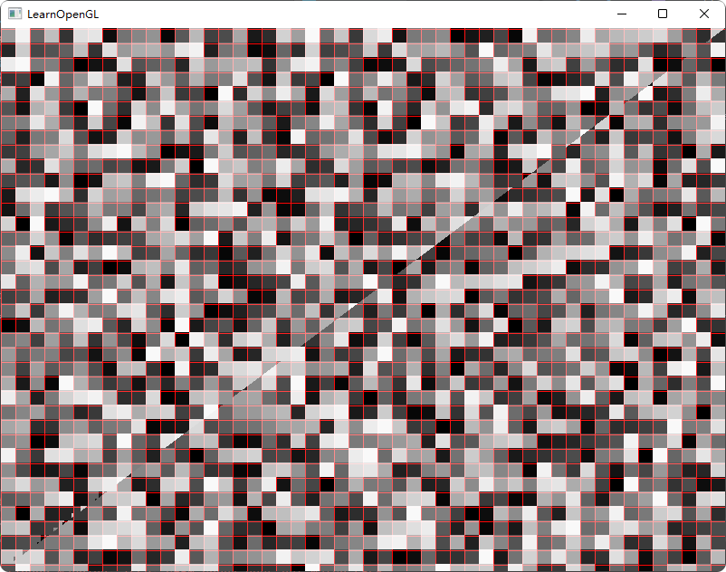

# NVGPUExtensionTest

## warp的数量

下面是代码和图，16x16是红色网格，可以看出颜色是按照16x16的格子区分，所以sm处理16x16个像素。
```
#version 330 core
#extension GL_NV_shader_thread_group: enable
out vec4 FragColor;
in vec3 FragPos;

void main()
{
    //smid 的色阶  相同色阶就是同个sm处理的像素
    float sm_id = float(gl_SMIDNV) / float(gl_SMCountNV);
    // 将纹理坐标缩放到0-9区间内
    vec2 texCoord = gl_FragCoord.xy;
    // 计算网格位置
    int xGrid = int(texCoord.x);
    int yGrid = int(texCoord.y);
    // 根据网格位置确定颜色
    float r = (xGrid % 16 == 0 || (yGrid + 10) % 16 == 0) ? 1.0 : sm_id;
    FragColor = vec4(r, sm_id, sm_id, 1.0);
}
```


