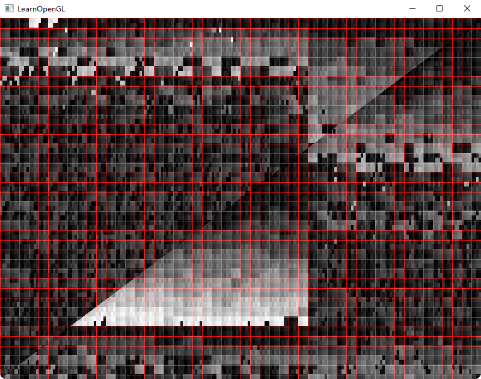
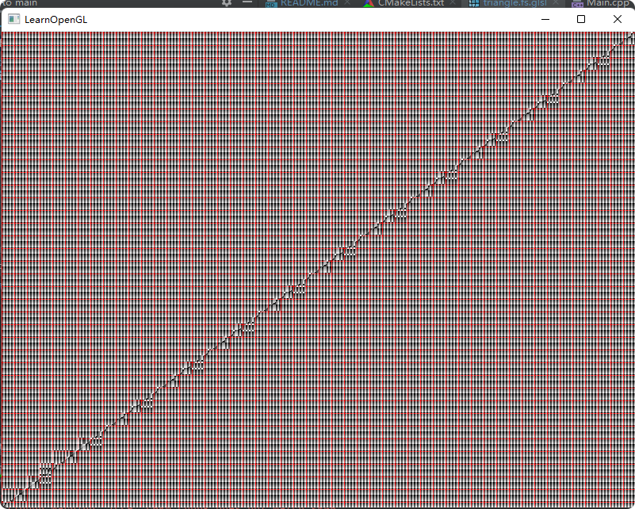

# NVGPUExtensionTest

gl_SMIDNV: the SM id.
gl_SMCountNV: the number of SMs on the GPU.
所以gl_SMIDNV/gl_SMCountNV是同个值同个颜色，说明SMID一样 在一个SM里

gl_WarpsPerSMNV: the number of warps running on a SM.
gl_WarpIDNV: the warp id
所以gl_WarpIDNV/gl_WarpsPerSMNV是同个值同个颜色，说明WarpID一样 在一个Warp里 也是在一个SM

gl_ThreadInWarpNV: warp的threadid
gl_WarpSizeNV: warp threadsize

## SM

下面是代码和图，16x16是红色网格，可以看出颜色是按照16x16的格子区分，所以sm处理16x16个像素。
1、色阶的数量就是SMID的数量 那么就是SM的数量
2、一个色阶是16x16说明一个SM处理256个像素，那么是256个core
3、SM之间是无序分配
4、不同三角形一定在不同的SM里
5、会有不满16x16像素的 说明有陪跑的core  或者多个区域用一个SM
```
#version 330 core
#extension GL_NV_shader_thread_group: enable
out vec4 FragColor;
in vec3 FragPos;

void main()
{
    //smid 的色阶  相同色阶就是同个sm处理的像素
    float sm_id = float(gl_SMIDNV) / float(gl_SMCountNV);
    // 将纹理坐标缩放到0-9区间内
    vec2 texCoord = gl_FragCoord.xy;
    // 计算网格位置
    int xGrid = int(texCoord.x);
    int yGrid = int(texCoord.y);
    // 根据网格位置确定颜色
    float r = (xGrid % 16 == 0 || (yGrid + 10) % 16 == 0) ? 1.0 : sm_id;
    FragColor = vec4(r, sm_id, sm_id, 1.0);
}
```


## warp

1、32个色阶说明，每个SM有32个Warp
2、每个色块像素是4x8 每个warp有8个core， 但是一个warp只能独占一个sm，所以8个 warp轮流进入这个SM调度？
3、



## thread id

